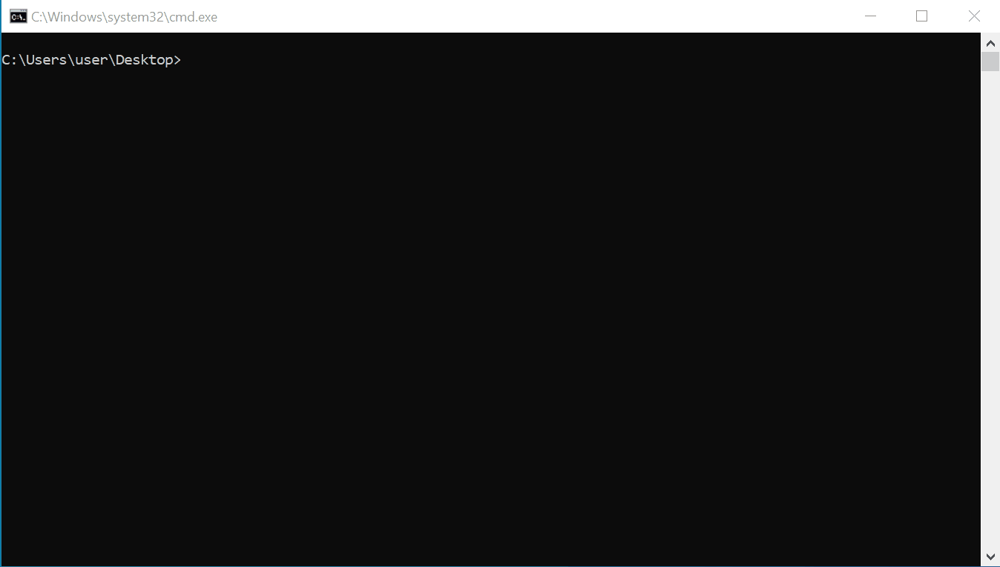

# smb2os
Use smb2 protocol to detect remote computer os version, support win7/server2008-win10/server2019

# basic
vs2019 + net2.0 + c#

# usage
smb2os.exe 192.168.1.100  
powershell.exe -ep bypass -f smb2os.ps1 192.168.1.100
